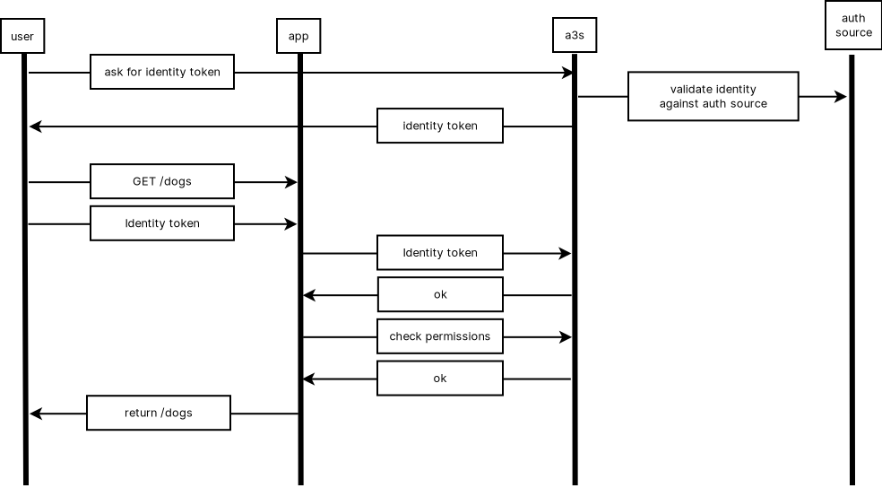

# A3S

> NOTE: This is a work in progress.

A3S (stands for Auth As A Service) is an authentication and ABAC authorization
server.

It allows to normalize various sources of authentication like OIDC,
AWS/Azure/GCP tokens, LDAP and more into a generic identity token that contains
identity claims (rather than scopes). These claims can be used by some
authorization policies to give a particular subset of bearers various
permissions.

These authorization policies match a set of bearers based on a logical claims
expression (like `group=red and color=blue or group=admin`) and they apply to a
namespace.

A namespace is a node that is part of hierarchical tree that represents an
abstract organizational unit. The root namespace is named `/`.

Basically, an authorization policy allows a subset of bearers, defined by claims
retrieved from an authentication source, to perform actions in a particular
namespace and all of its children.

Apps can receive a request alongside a delivered identity token then check with
A3S if the current bearer is allowed to perform a particular action in a
particular namespace.

## Table of contents

<!-- vim-markdown-toc GFM -->

* [Quick start](#quick-start)
* [Using the system](#using-the-system)
	* [Install a3sctl](#install-a3sctl)
	* [Obtain a root token](#obtain-a-root-token)
	* [Test with the sample app](#test-with-the-sample-app)
* [Obtaining identity tokens](#obtaining-identity-tokens)
	* [Restrictions](#restrictions)
	* [Cloaking](#cloaking)
	* [Identity modifiers](#identity-modifiers)
	* [Authentication sources](#authentication-sources)
		* [MTLS](#mtls)
			* [Create an MTLS source](#create-an-mtls-source)
			* [Obtain a token](#obtain-a-token)
		* [LDAP](#ldap)
			* [Create an LDAP source](#create-an-ldap-source)
			* [Obtain a token](#obtain-a-token-1)
		* [HTTP](#http)
			* [Create an HTTP source](#create-an-http-source)
			* [Obtain a token](#obtain-a-token-2)
		* [OIDC](#oidc)
			* [Create an OIDC source](#create-an-oidc-source)
			* [Obtain a token](#obtain-a-token-3)
		* [A3S remote identity token](#a3s-remote-identity-token)
			* [Create an A3S source](#create-an-a3s-source)
			* [Obtain a token](#obtain-a-token-4)
		* [Amazon STS](#amazon-sts)
		* [Google Cloud Platform token](#google-cloud-platform-token)
		* [Azure token](#azure-token)
		* [A3S local identity token](#a3s-local-identity-token)
* [Writing authorizations](#writing-authorizations)
	* [Subject](#subject)
	* [Permissions](#permissions)
	* [Target namespaces](#target-namespaces)
	* [Examples](#examples)
* [Check for permissions from your app](#check-for-permissions-from-your-app)
* [Using a3sctl](#using-a3sctl)
	* [Completion](#completion)
		* [Bash](#bash)
		* [Zsh](#zsh)
		* [Fish](#fish)
	* [Configuration file](#configuration-file)
	* [Auto authentication](#auto-authentication)
* [Import](#import)
	* [Simple Import files with a3sctl](#simple-import-files-with-a3sctl)
	* [Templating with a3sctl](#templating-with-a3sctl)
* [Dev environment](#dev-environment)
	* [Prerequesites](#prerequesites)
	* [Initialize the environment](#initialize-the-environment)
	* [Start everything](#start-everything)
* [Support](#support)
* [Contributing](#contributing)

<!-- vim-markdown-toc -->

## Quick start

The easiest way to get started is to use the `docker-compose.yaml` in the `dev`
folder.

First, generate the needed certificates:

	dev/certs-init

This creates the certificates in `dev/.data/certificates` that the A3S container
will mount (the same certificates will be used by the dev environment, described
later).

Then build the docker container:

	make docker

And finally start the docker-compose file:

	cd ./dev
	docker compose up

## Using the system

You can start to interact with the system by using the raw API with curl or
using the provided cli named `a3sctl`. The later provide a streamlined interface
that makes it more pleasant to use than the raw API.

### Install a3sctl

To install the cli, run:

	make cli

This will install `a3sctl` into you`$GOBIN` folder. You should have this folder
in your `$PATH` if you want to use the cli without needing to enter its full
path.

### Obtain a root token

In order to configure the system and create additional namespaces,
authorizations, etc, you need to obtain a root token to start interacting with
the server:

	 a3sctl auth mtls \
		--api https://127.0.0.1:44443 \
		--api-skip-verify \
		--cert dev/.data/certificates/user-cert.pem \
		--key dev/.data/certificates/user-key.pem \
		--source-name root

> NOTE: In production environment, never use --api-skip-verify. You should
> instead trust the CA used to issue A3S TLS certificate.

This will print a token that you can use for subsequent calls. You can set the
`$A3SCTL_TOKEN` environment variable to use it automatically.

> NOTE: There are easier ways to deal with retrieving a token when using a3sctl.
> as it will be explained later.

If you want to check the content of a token, you can use:

	$ a3sctl auth check --token <token>
	alg: ES256
	kid: 1DAA6949AACB82DBEF1CFE7D93586DD0BF1F090A

	{
	  "exp": 1636830341,
	  "iat": 1636743941,
	  "identity": [
		"@source:name=root"
		"@source:namespace=/",
		"@source:type=mtls",
		"commonname=Jean-Michel",
		"fingerprint=C8BB0E5FA7644DDC97FD54AEF09053E880EDA939",
		"issuerchain=D98F838F491542CC238275763AA06B7DC949737D",
		"serialnumber=219959457279438724775594138274989969558",
	  ],
	  "iss": "https://127.0.0.1",
	  "jti": "b2b441a0-5283-4586-baa7-4a45147aaf46"
	}

You can omit `--token` if you have set `$A3SCTL_TOKEN`. If you need to print the
raw token, you can use the `--print` flag.

### Test with the sample app

There is a very small python Flask server located in `/example/python/testapp`.
It comes with a script that creates a namespace, an MTLS source and two
authorizations that will be used to demo a basic use of A3S.

You can take a look at the [README](examples/python/testapp/README.md) in that
folder to get started.

## Obtaining identity tokens

This section describes how to create the various sources of authenticatio, how
to retrieve a token from them, apply restrictions or apply cloaking.

All the following examples will assume to work in the namespace `/tutorial`. To
create it, you can run:

	export A3SCTL_API="https://127.0.0.1:44443"
	export A3SCTL_API_SKIP_VERIFY="true"
	export A3SCTL_NAMESPACE=/tutorial

	a3sctl api create namespace --with.name tutorial --namespace /

> NOTE: the env variable will tell a3sctl which namespace to target without
> having to pass the `--namespace` flag every time.

> NOTE: Some auth commands will require to pass the namespace of the auth
> source. You can either set `--source-namespace` or leave it empty to fallback
> on the value set by `--namespace`.

> NOTE: you can also get more info about a ressource by using the `-h` flag.
> This will list all the possible properies the api supports.

### Restrictions

Whichever authentication source you are using, you can always ask for a
restricted token. A restricted token contains additional user requested
restrictions preventing actions that would normally be possible to do based on
the authorizations stored in the server, matching the bearer claims.

* `--restrict-namespace`: a namespace restricted token will only be valid if
    used on the restricted namespace or one of its children.
* `--restrict-network`: a network restricted token can only be used if the
    source network from which it is used is contained in one of the restricted
    networks.
* `--restrict-permissions`: limits what permissions the token will have. For
    instance if your authorization set grants `dog:eat,sleep`, you may ask for a
    token that will only work for `dog:eat`.

### Cloaking

It is possible to limit the amount of identity claims that will be embedded into
the identity token by using the `--cloak` flag. This can be useful for privacy
reasons. For instance, if a party requests you to have `color=blue` and this is
the only claim that matters, you can hide the rest of your claims by passing

    --cloak color=blue

Cloaking uses prefix matching. So you can decide to only embed the color and
size claims (if you have multiple of them) by doing:

    --cloak color= --cloak size=

### Identity modifiers

Certain authentication sources allow to set an additional identity modifier.
This is an URL to an HTTPS server running on your own premises, that will be be
called by A3S when it is about to deliver a token from the source.

One reason one may want to do so is to enhance claims based on an external
system. We can imagine an A3S server run by a health care provider, that may
trust a more global A3S instance. This instance could return a claim based the
bearer's SSN and the health care provider may want to deliver a token that would
contain additional information, like a blood type for instance. The identity
modifier would then query an external database to match the blood type on record
with the bearer SSN.

The server will receive the claims that are about to be delivered, and will
have a chance to modify the list. The server must impplement MTLS authentication
and must accept the certificates set in the source modifier.

The server must return `200` if it did modify the claims or `204` if it did not.
Any other code will be treated as an error.

The source modifier allows to set the HTTP method to use when calling the remote
server. If it is `POST`, `PUT` or `PATCH`, A3S will send the claims as a JSON
array encoded in the body. For `GET`, the server will set the claims in the
query parameter `claim`.

In any case, the server will receive the following headers, describing the
source that was used to derive the identity claims:

* `x-a3s-source-type`
* `x-a3s-source-namespace`
* `x-a3s-source-name`

The server must return the list of modified claims as a JSON encoded array in
the body of the response.

A server must not insert any identity claim starting with the symbol `@` or A3S
will refuse to deliver the token.

> NOTE: You can find a naive implementation of a claim modifier in
> `examples/python/claimmod`. You can take a look at the
> [README](examples/python/claimmod/README.md) in that folder.

### Authentication sources

While A3S allows to verify the identity of a token bearer, it does not provide
any way to store information about the users. In order to derive identity
claims, A3S relies on third-party authentication sources, who hold the actual
data about a bearer.

#### MTLS

The MTLS source uses mutual TLS to authenticate a client. The client mustpresent
a client certificate (usage set to auth client) that is signed by the CA
provided in the designed MTLS auth source.

> NOTE: this authentication source supports identity modifiers.

##### Create an MTLS source

You first need to have a CA that can issue certificates for your users. In this
example, we use `tg`, but you can use any PKI tool you like.

	tg cert --name myca --is-ca
	tg cert --name user1 \
		--signing-cert myca-cert.pem \
		--signing-cert-key myca-key.pem

> NOTE: tg can be installed by running `go install go.aporeto.io/tg@master

> NOTE: Not protecting a private key with a passphrase is bad. Don't do this in
> production.

Then we need to create the MTLS auth source:

	a3sctl api create mtlssource \
		--with.name my-mtls-source \
		--with.certificate-auhority "$(cat myca-cert.pem)"

##### Obtain a token

To obtain a token from the newly created source:

	a3sctl auth mtls \
		--source-name my-mtls-source \
		--source-namespace /tutorial \
		--cert user1-cert.pem \
		--key user1-key.pem

If the private key is encrypted, you need to set the flag `--pass <passphrase>`.

> NOTE: you can set `-` for '--pass`. In that case, a3sctl will ask for user
> input from stdin.

#### LDAP

A3S supports using a remote LDAP as authentication source. The LDAP server must
be accessible from A3S. A3S will refuse to connect to an LDAP with no form of
encryption (TLS or STARTTLS).

> NOTE: this authentication source supports identity modifiers.

##### Create an LDAP source

To create an LDAP source, run:

	a3sctl api create ldapsource \
		--with.name my-ldap-source \
		--with.address 127.0.0.1:389 \
		--with.certificate-authority "$(cat ldap-ce-cert.pem)" \
		--with.base-dn dc=universe,dc=io \
		--with.bind-dn cn=readonly,dc=universe,dc=io \
		--with.bind-password password

* The `base-dn` is the DN to use to search for users.
* Yhe `bind-dn` is the account A3S will use to connect to the ldap. It should be
	a readonly account.
* The `bind-password` is the password associated to the `bind-dn`.

You can also use `--certificate-auhority` to pass a custom CA if the
certificates used by the server are not trusted by the host running A3S.

You can decide to ignore certain attribute by using the flag `--ignore-keys`.
The opposite way is also posible by using `--include-keys` to only include the
desised attributes. If the same attribute is set in both flag, it will end up
being ignored.

##### Obtain a token

To obtain a token from the newly created source:

	a3sctl auth ldap \
		--source-name my-ldap-source \
		--namespace /tutorial \
		--user bob \
		--pass s3cr3t

> NOTE: you can set `-` for '--user` and/or `--pass`. In that case, a3sctl will
> ask for user input from stdin.

#### HTTP

A3S supports using a remote HTTP server as authentication source. The HTTP
server must be accessible from A3S. A3S will refuse to connect if the server
does not support MTLS. This can be used to link to your own internal account
system.

When an HTTP source is used, A3S will send a POST request to the corresponding
server containing a json encoded map with the following items:

* `username`: the user provided user name.
* `password`: the user provided password.
* `TOTP`: optional one time password for 2FA.

The server must respond `200` with a body containing the claims to insert in the
token as json encoded array (for instance: `["username=bob", "bu=eng"]`). Any
other status code will be returned as an `401` error to the user.

> NOTE: this authentication source supports identity modifiers.

##### Create an HTTP source

To create an HTTP source, run:

	a3sctl api create httpsource \
		--with.name my-http-source \
        --with.url https://myserver.com/login \
		--with.certificate-authority "$(cat ca-cert.pem)" \
		--with.certificate "$(cat client-cert.pem)" \
		--with.key "$(cat client-key.pem)" \

##### Obtain a token

To obtain a token from the newly created source:

	a3sctl auth http \
		--source-name my-http-source \
		--namespace /tutorial \
		--user bob \
		--pass s3cr3t \
        --totp 1234

> NOTE: you can set `-` for '--user` and/or `--pass`. In that case, a3sctl will
> ask for user input from stdin.

#### OIDC

A3S can retrieve an identity token from an existing OIDC provider in order to
deliver normalized identiy tokens.

> NOTE: this authentication source supports identity modifiers.

##### Create an OIDC source

Configuring a valid OIDC provider is beyond the scope of this document. However,
they will all work the same and will provide you with a client ID, a client
secret and an endpoint.

It is however important to allow `http://localhost:65333` as a redirect URL from
your provider confguration if you plan to use a3sctl to authenticate.

Once the provider is configuired, create an OIDC source:

	a3sctl api create oidcsource \
		--with.name my-oidc-source \
		--with.client-id <client id> \
		--with.client-secret <client secret> \
		--with.endpoint https://accounts.google.com \
		--with.scopes '["email", "given_name"]'

The scopes indicate the OIDC provider which claim to return. They will vary
depending on your provider.

You can also use `--certificate-auhority` to pass a custom CA if the
certificates used by the OIDC providers are not trusted by the host running A3S.

##### Obtain a token

While all the other sources can be used easily with curl for instance, the OIDC
source needs to run a http server and needs to perform a dance that is quite
painful to do manually. a3sctl will do all of this transparently.

To obtain a token from the newly created source:

	a3sctl auth oidc \
		--source-name my-oidc-source \
		--source-namespace /tutorial

This will print a URL to open in your browser to authenticate against the OIDC
provider. Once completed, the provider will reply and the token will be
displayed.

#### A3S remote identity token

This authentication source allows to issue a token from another one issued by
another A3S server. It allows to trust other A3S instances and issue local
tokens from trusted ones, while potentially augmenting the identity claims.

> NOTE: this authentication source supports identity modifiers.

##### Create an A3S source

You need to create an A3S source in order to validate the remote tokens. The
source requires to pass the raw address of the remote A3S server, as it will use
the well-known jwks URL to retrieve the keys and verify the token signature.

To create an A3S source:

	a3sctl api create a3ssource \
		--with.name my-remote-a3s-source \
		--with.issuer https://remote-a3s.com

You can also use `--certificate-auhority` to pass a custom CA if the
certificates used by the server are not trusted by the host running A3S.

If the issuer is not identical to the root URL of the remote A3S server, you can
use the `--with.endpoint` flag to pass the actual URL.

##### Obtain a token

To obtain a token from the newly created source:

	a3sctl auth remote-a3s \
		--source-name my-remote-a3s-source \
		--source-namespace /tutorial \
		--input-token <token>

#### Amazon STS

This authentication source does not need custom source creation as it uses AWS
broadly. How to retrieve a token from AWS is beyond the scope of this document.
However, if you run a3sctl from an EC2 instance that has an IAM role assigned,
it will retrieve one for you, if you don't pass any additional information.

If you are not running the command on AWS:

	a3sctl auth aws \
		--access-key-id <kid> \
		--access-key-secret <secret> \
		--access-token <token>

If you are running it from an AWS EC2 instance, you just need to run:

	a3sctl auth aws

#### Google Cloud Platform token

This authentication source does not need custom source creation as it uses GCP
broadly. How to retrieve a token from GCP is beyond the scope of this document.
However, if you run a3sctl from a GCP instance, it will retrieve one for you, if
you don't pass any additional information

If you are not running the command on GCP:

	a3sctl auth gcp --access-token <token>

If you are running it from an GCP instance, you just need to run:

	a3sctl auth gcp

####  Azure token

This authentication source does not need custom source creation as it uses Azure
broadly. How to retrieve a token from Azure is beyond the scope of this
document. However, if you run a3sctl from an Azure instance, it will retrieve
one for you, if you don't pass any additional information

If you are not running the command on GCP:

	a3sctl auth azure --access-token <token>

If you are running it from an Azure instance, you just need to run:

	a3sctl auth azure

#### A3S local identity token

You can use an existing A3S identity token to ask for another one. Note that is
not a renew mechanism. The requested token cannot expire later than the original
one. The goal of this authentication source is to ask for a more restricted
and/or cloaked version of the original.

This authentication source does not need custom source creation.

To get obtain a token:

    a3sctl auth a3s --token <token> \
        --restrict-namespace /a/child/ns \
        --restrict-network 10.0.1.1/32 \
        --restrict-permissions "dog:eat,sleep"

## Writing authorizations

The Authorizations allows to match a set of users (subjects) based on a claim
expression and assign them permissions. Authorizations work on white list model.
Everything that is not explicitely allowed is forbidden.

### Subject

A matching expression can be described as a basic boolean sequence like
`(org=acme && group=finance) || group=admin`. They are represented by a
2-dimensional array. As such, the expression above is written:

	[
		[ "org=admin", "group=finance" ],
		[ "group=admin" ]
	]

The first dimension represents `or` clauses and the second represents `and`
clauses.

As there are many source of authorizations and delivered claims can overlap,
potentially given way broader permissions than expected, the identity token
always contains additional claims allowing to discriminate bearers based on the
authentication source they used.

* `@source:type`: The type of source that was used to deliver the token.
* `@source:namespace`: The namespace of the source that was used.
* `@source:name`: The name of the source.

> NOTE: Claims starting with the symbol `@` are reserved. If an authentication
> source tries to insert such claims, all prefixing `@` will be removed.

This way, you can differentiate `name=bob` based on which Bob we are aiming. A
safe subject to use in that case:

	[
		["@source:type=ldap", "@source:namespace=/my/ns", "name=bob"]
	]

The authorization will only match Bob who got a token from any LDAP
authentication source that has been declared in `/my/ns`. Another Bob from
another namespace or coming from an OIDC source will not match.

### Permissions

Authorizations also contain a set of permissions that describes what the
matching bearers can do. They are generic (ie they don't make assumptions about
the underlying protocol you are using) and are represented by a string of the
form:

	"resource:action1,...,actionN[:id2,...idN]"

For instance, the following allows the bearer to walk and pet the dogs:

	"dogs:pet,walk"

The following allows the bearer to GET /admin:

	"/admin:get"

The following allows to get and put authorizations with ID 1 or 2:

	"authorizations:get,put:1,2"

Permissions can use the `*` as resource or actions to match any. As such, the
following permission gives the bearer admin access:

	"*:*"

An authorization contains an array of permissions, granting the bearer the union
of them. If multiple authorizations match the bearer identity token, then the
union of all their permissions will be granted.

### Target namespaces

An authorization lives in a nanmespace and can target the current namespace of
some of their children. Authorizations propagate down the namespace hierarchy
starting from where it applied. It can not affect parents or sibling namespaces.

### Examples

We can create the authorization described above with the following command:

	a3sctl api create authorization
		--namespace /my/namespace \
		--with.name my-auth \
		--with.target-namespaces '["/my/namespace/app1"]' \
		--with.subject '[
			[
				"@source:type=oidc",
				"@source:namespace=/my/namespace",
				"org=admin",
				"group=finance",
			],
			[
				"@source:type=mtls",
				"@source:namespace=/my",
				"@source:name=admins",
				"group=admin",
			]
		]' \
		--with.permissions '["dogs:pet,walk"]'

> NOTE: If you omit `--target-namespace`, then the authorization applies to its
> own namespace and children.

## Check for permissions from your app

A3S provides some API to verify if a token bearer is allowed to performed some
actions. The easiest way to implement this is to add an authentication
middleware in whatever HTTP framework you are using to call A3S to verify a
token and its permissions. This middleware can call the all-in-one check
endpoint `/authz`. The following example uses curl, but you should use the HTTP
communication layer currently used in your application.

	curl -H "Content-Type: application/json" \
		-d '{
			"token": <token>,
			"resource": "/dogs"
			"action": "walk",
			"namespace: /application/namespace",
			"audience": "my-app",
		}' \
		https://127.0.0.1:44443/authz

This would return `204` if the bearer is allowed to walk the dogs in
`/application/namespace`, or `403` if either the token is invalid or the bearer
is not allowed to perform such action.

This method is the simplest but have a few drawbacks. For instance, you will
make A3S validate the token everytime, you need to make a call everytime, and
you need to transmit the bearer token at every call.

A more optimized method will be described here soon, that allows to:

* Validate token signature yourself locally
* Retrieve the entire permissions set for a given token for caching
* Validate the permissions locally
* Be notified when cached permissions needs to be invalidated.

> NOTE: This method requires the third party application to be able to connect
> to the push channel, and hence will require to be authenticated.

## Using a3sctl

a3sctl is the command line that allows to use A3S API in a user friendly manner.
It abstracts the ReST API and is self documenting. You can always get additional
help by passing the flags `--help` (or `-h`) in any command or sub command.

### Completion

a3sctl supports auto completion:

#### Bash

	. <(a3sctl completion bash)

#### Zsh

	compdef _a3sctl a3sctl
	. <(a3sctl completion zsh)

#### Fish

	. <(a3sctl completion fish)

### Configuration file

a3sctl can read the values of its flags from various places, in that order:

* A flag directly provided, or
* Env variable (ie `$A3SCTL_SOURCE_NAME` for `--source-name`), or
* The config file (default: `~/.config/a3sctl/default.yaml`)

You can choose the config file to user by setting the full path of the file
using the flag `--config` (or `$A3SCTL_CONFIG`).

You can also pass the name of the config, without its folder or its extension
through the flag `--config-name` (or `$A3SCTL_CONFIG_NAME`). a3sctl will scan
the following folder, in that order, to find a configuration file matching the
name:

* `~/.config/a3sctl/`, or
* `/usr/local/etc/a3sctl/`, or
* `/etc/a3sctl/`

### Auto authentication

In addition to one-to-one mapping of a3sctl flags in the config file, you can
also add the key `autoauth` to automatically retrieve, cache, reuse and renew a
token using a particular authentication source. This method works for mtls and
ldap.

For instance, in `~/.config/a3sctl/default.yaml`:

    api: https://127.0.0.1:44443
    namespace: /

    autoauth:
        enable: mtls
        ldap:
            user: okenobi
            pass: '-'
            source:
                name: root
                namespace: /
        mtls:
            cert: /path/to/user-cert.pem
            key: /path/to/user-key.pem
            pass: '-'
            source:
                name: root
                namespace: /

You can decide which source to use for auto authentication by setting the
`enable` key. Leave it empty to disable auto auth.

The token is cached in `$XDG_HOME_CACHE/a3sctl/token-<src>-<api-hash>` and will
automatically renew if it's past its half-life.

> NOTE: using `-` for secrets will automatically prompt the user for input during
> retrieval or renewing of the token.

## Import

A3S allows to manage the content of a namespace through declarative import. At
its core, importing is done using the `/import` api.

The following resources can be imported.

* All kind of sources (`oidcsources`, `mtlssources`, etc...)
* `authorizations`

An import must provide a label in order to recognize all the resources imported.
This will help the system to realign any changes between the import declarartion
and the current state of the system. You must ensure the provided label is
unique to an import in a namespace, or you may face unintended side effects. The
label will be stored into the `importLabel` property of the resources.

Imported resources uses a hash (stored in `importHash`) to determine if the data
provided in the import request has changed or not. If the data is unmodified,
the import will leave the object in place. If it has been modified, the import
system will delete, then recreate a new version of the object (that means its
`ID` will change).

### Simple Import files with a3sctl

a3sctl provides an easy way to deal with import declarations stored in a YAML
file.

For instance:

	label: my-import-label
	Authorizations:
	  - name: authorization-a
		subject:
		- - "@source:type=mtls"
		  - "@source:name=default"
		  - "@source:namespace=/ns"
		  - "commonname=john"
		permissions:
		- /resource-a:GET
	  - name: top-secret-access
		subject:
		- - "@source:type=mtls"
		  - "@source:name=default"
		  - "@source:namespace=/ns"
		  - "commonname=michael"
		permissions:
		- /resource-b:GET
		- /resource-c:GET

This file declares two `authorizations`, under the label `my-import-label`.

To import this file, run:

	a3sctl api create import \
		--input-file path/to/file.yaml

### Templating with a3sctl

Import files support [go templating](https://pkg.go.dev/text/template) with
[sprig](https://masterminds.github.io/sprig/) functions, as well as `helm` style
values management.

> NOTE: you can check the rendering of the template by passing `--render`

For instance, consider the following file:

	label: my-templated-import:
	MTLSSources:
	- name: {{ .Values.name }}
	  description: {{ .Values.desc }}
	  CA: |-
	  {{ readFile "path/to/ca.pem" | indent 4 }}

This file can be imported using the following command:

	a3sctl api create import --input-file mytemplate.gotmpl \
		--input-set name=hello \
		--input-set "desc=the description"

This will replace `{{ .Values.name }}` and `{{ .Values.desc }}` by `hello` and
`the description` respectively. You can also notice the call to `readFile` that
will be replaced by the content of the file given as parameter.

In addition to the `.Values` dictionary, there are the following additional
values that can be accessed:

- `{{ .Common.API }}`: the value of the --api flag
- `{{ .Common.Namespace }}`: The value of --namespace flag

Finally, you can store the values in their own files, and use it to populate a
template. For instance:

	name: hello world
	description: the description

You can use the values in that file by doing:

	a3sctl api create import --input-file mytemplate.gotmpl \
		--input-values myvalues.yaml

## Dev environment

### Prerequesites

First, clone this repository and make sure you have the following installed:

* go
* mongodb
* nats-server
* tmux & tmuxinator

### Initialize the environment

If this is the first time you start the environment, you need to initialize
various things.

First, initialize the needed certificates:

	dev/certs-init

Then initialize the database:

	dev/mongo-init

All the development data stored stored in `dev/.data`. If you delete this
folder, you can reinitialize the environment.

All of A3S configuration is defined as env variables from `dev/env`

Finally, you must initialize the root permissions. A3S makes no exception or
have any hardcoded or weak credentials, so we must add an authentication source
and an authorization.

To do so, run:

    dev/a3s-run --init --init-root-ca dev/.data/certificates/ca-acme-cert.pem

> NOTE: even if you are in the `dev` folder the root CA must be passed relative
> to the root of the repository.

### Start everything

Once initialized, start the tmux session by running:

	dev/env-run

This will launch a tmux session starting everything and giving you a working
terminal. To exit:

	env-kill

## Support

Please read [SUPPORT.md](SUPPORT.md) for details on how to get support for this
project.

## Contributing

We value your contributions! Please read
[CONTRIBUTING.md](https://github.com/PaloAltoNetworks/.github/CONTRIBUTING.md)
for details on how to contribute, and the process for submitting pull requests
to us.
